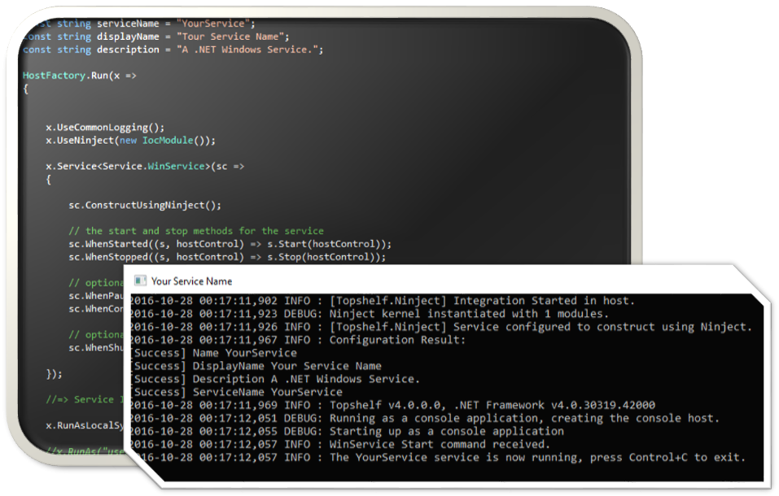

Windows-Service-Plus
======================

Windows-Service-Plus is a Visual Studio 2015 Project Template to get you started with a full featured Windows Service based on [TopShelf]( http://topshelf-project.com/) and pre-loaded with logging, IoC container and more. 

The idea is that you should be able to focus directly on your service logic right from the start, bypassing all the plumbing and boilerplate code.

Defaults are reasonable and will apply to most services but of course you can always change it to fit your needs

Since we are using [TopShelf]( http://topshelf-project.com/), you get a service that is easier to test and deploy. Not to mention the hability to run and debug the service as a console application.
You don't have to be know [TopShelf]( http://topshelf-project.com/) to take advantage of this project template but it is something worth checking.



#### Download the Extension

Get the extension from the Visual Studio Extension Gallery:

### Getting Started

After the project is created just hit `F5` and it should download the required nugget packages and run as a console application.

Your service logic should go on the `Start` method of `Service\WinService.cs`

```csharp
    public bool Start(HostControl hostControl)
    {                        
        Log.Info($"{nameof(Service.WinService)} Start command received.");
        Console.WriteLine("My first windows servce");            
        return true;
    }
```

### Basic Settings

Basic settings can be changed on `Program.cs`.
You should start by setting the service Name, Display Name and Description.

```csharp
    const string serviceName = "YourService";
    const string displayName = "Your Service Name";
    const string description = "A .NET Windows Service.";
```

Comment or uncomment other options to change defaults used during the service installation such as service identity and more.

```csharp
    //=> Service Identity 
    x.RunAsLocalSystem();
    //x.RunAs("username", "password"); 
    //x.RunAsNetworkService();

    //=> Service Settings 
    //x.StartAutomatically(); 
```
    

### Tools

The created project will have a dependency on Nuget packages for the the following tools, framework and/or libraries:

* [TopShelf]( http://topshelf-project.com/): used to create the Windows Service.
* [Common.Logging]( https://github.com/net-commons/common-logging): used to abstract the log implementation.
* [log4net]( http://logging.apache.org/log4net/): used as the concrete log framework.
* [Ninject]( http://www.ninject.org/): used for dependency injection.

### Defaults

These are the project defaults:

* Daily log to a text file under the 'Logs' directory.
* Maximum 5MB per log file.
* Maximum 30 days of log files.
* Log level set to INFO.
* Log to console when service is running as a command line application.
* Windows Event Log appender fully configured but disabled.

To enable Windows Event log open file `NLog.config` and uncomment the line referring to `EventLogAppender`
To change default log level to INFO, just change the level on the same block from `TRACE` to `INFO`.

```xml
    <root>
      <level value="TRACE"/>
      <appender-ref ref="Console"/>
      <appender-ref ref="RollingFileAppender"/>
      <!--<appender-ref ref="EventLogAppender"/>-->
    </root>
```
